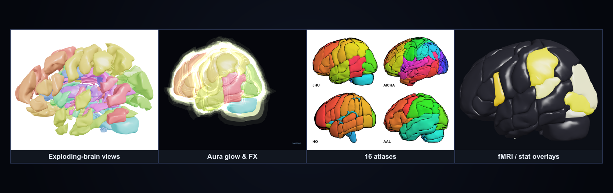
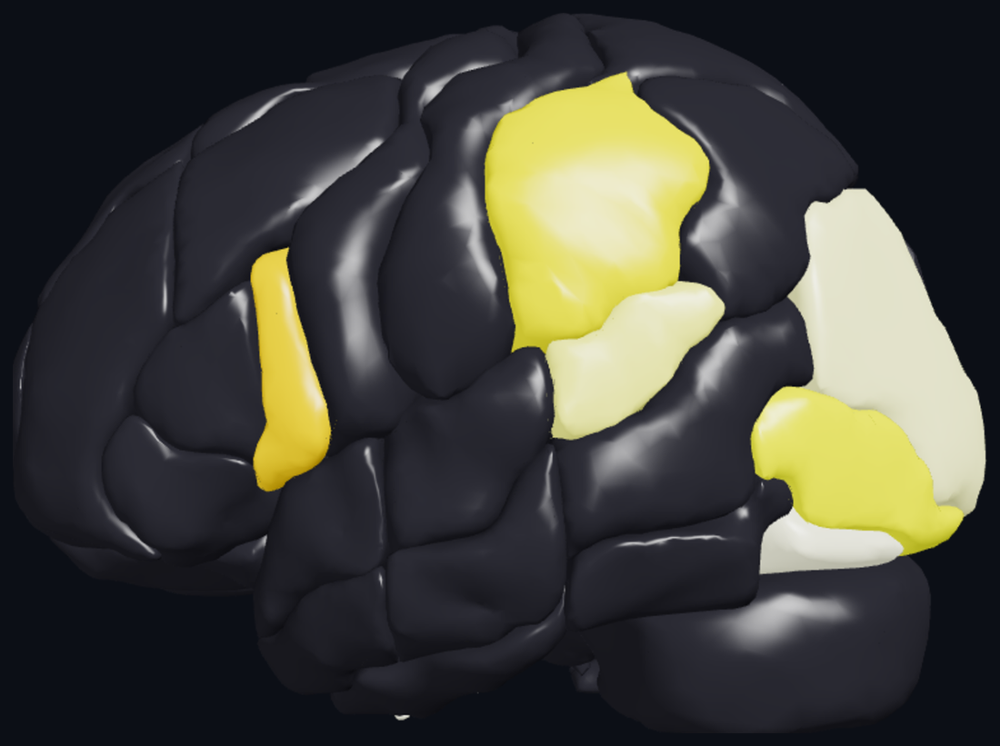
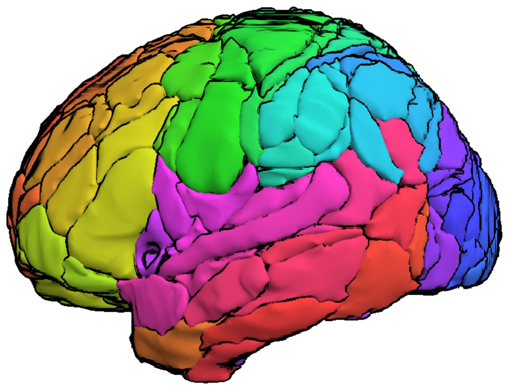
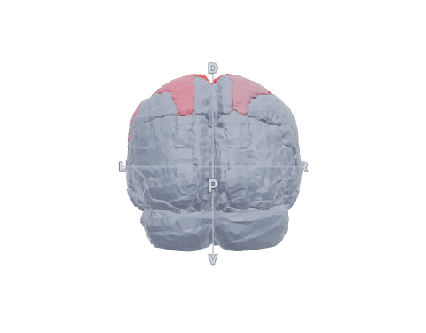
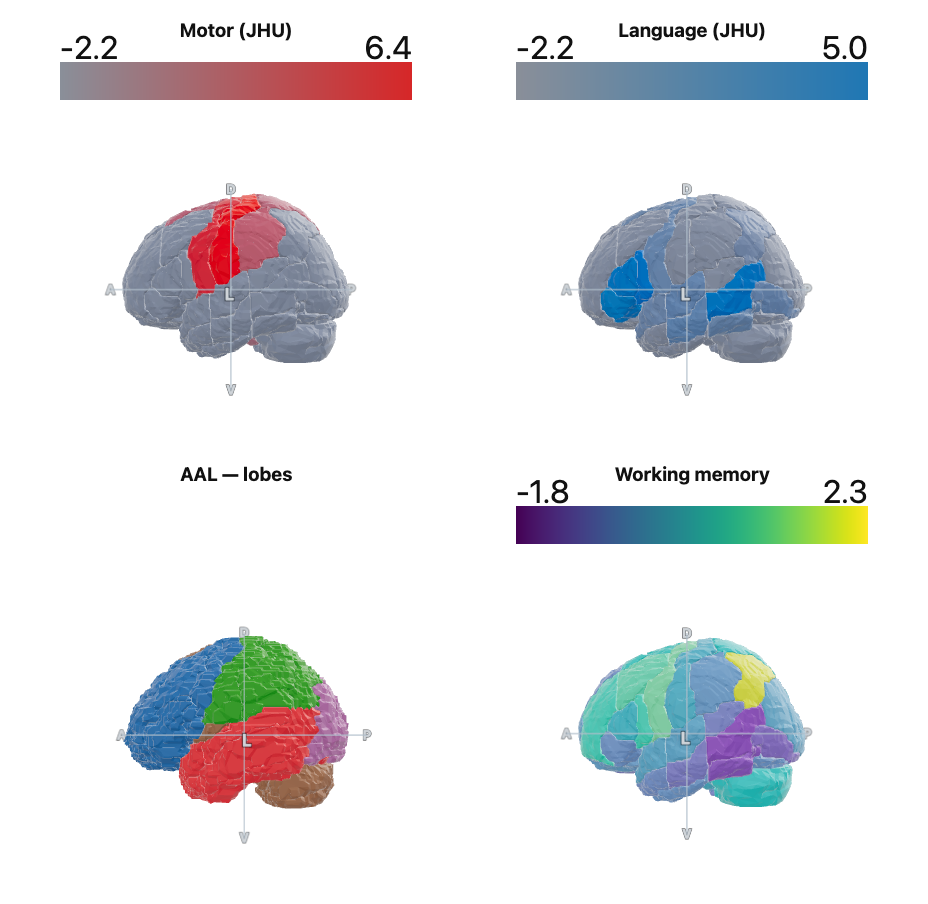
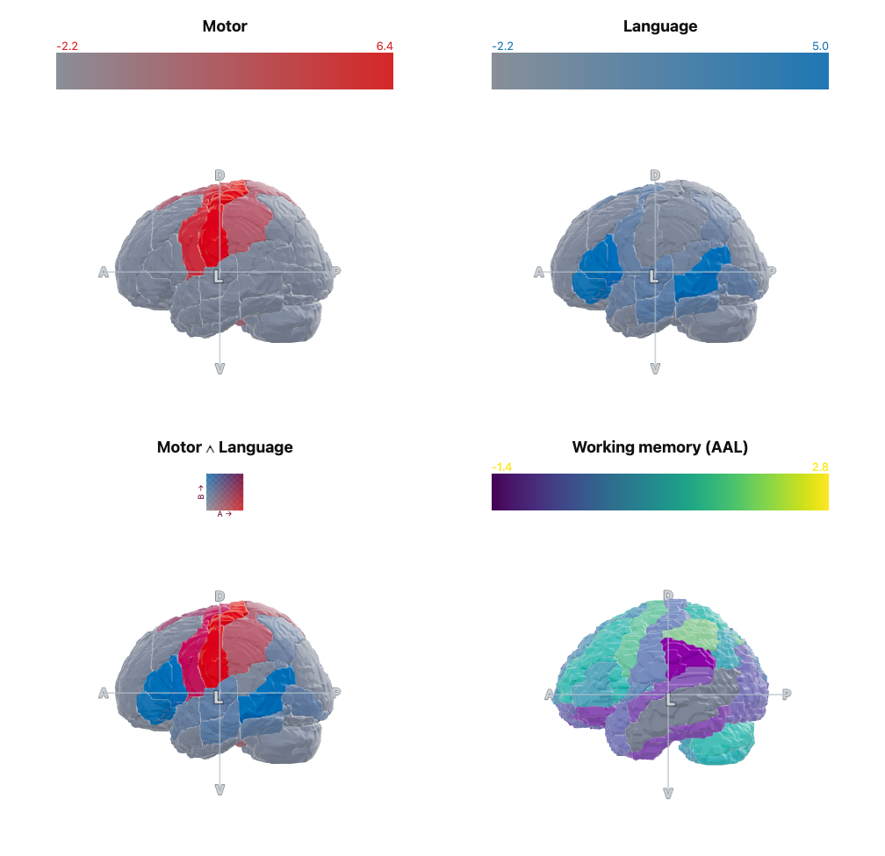
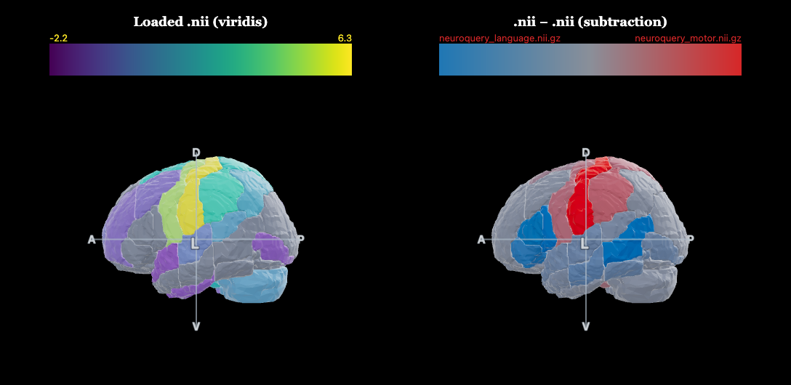

# 🧠 brainWhiz

**Interactive, multi-atlas "exploding-brain" viewer for neuroimaging figures.**
Render any brain parcellation in 3D, color regions by functional/statistical data,
draw DTI connectivity, and compose publication-ready figure panels — all in the browser.

### ▶ **[Live demo](https://rnorlund.github.io/brainWhiz/)**  ·  `index.html?atlas=aal`



---

## Highlights

- **6 bundled atlases**, switchable from a dropdown — JHU, AAL, Brodmann, AICHA, Catani, Fox.
- **Every ROI is its own 3D object** — explode, rotate, isolate, recolor, fade.
- **Functional / statistical overlays** — 20 baked NeuroQuery task maps *or* load your own MNI `.nii/.nii.gz`; regions colored by their mean value.
- **28 colormaps** (perceptual + colorblind-safe + diverging) and a "gray brain + one color" activation style.
- **DTI structural connectivity** averaged across 293 ABC participants — cylinders sized by tract strength, colormapped, with optional **pulsing flow**.
- **Figure tooling** — an in-app panel builder *and* a scriptable headless montage pipeline for reproducible multi-panel figures.

| Functional overlay (gray brain + activation) | AICHA atlas (384 ROIs) |
|---|---|
|  |  |

---

## Quick start



**Online:** just open the **[live demo](https://rnorlund.github.io/brainWhiz/)**.

**Local:** open `index.html` in Chrome/Safari (needs internet for the Three.js CDN).
Switch atlas with the **Atlas** dropdown or the URL: `index.html?atlas=jhu` (`aal`, `bro`, `aicha`, `catani`, `fox`).

> Loading a statistical `.nii/.nii.gz` works fully offline via the file picker — no server needed.

---

## Atlases (16 bundled)

| id | atlas | ROIs | connectivity | task maps |
|----|-------|-----:|:---:|:---:|
| `jhu` | JHU (Johns Hopkins) | 189 | ✅ | ✅ |
| `aicha` | AICHA | 384 | ✅ | ✅ |
| `anatomy3` | SPM Anatomy v3 | 186 | – | ✅ |
| `aal3` | AAL3 | 161 | – | ✅ |
| `aalcat` | AAL (categorized) | 150 | – | ✅ |
| `neuromorph` | Neuromorphometrics | 134 | – | ✅ |
| `ho` | Harvard-Oxford | 117 | – | ✅ |
| `aal` | AAL | 116 | – | ✅ |
| `bro` | Brodmann | 82 | – | ✅ |
| `lpba40` | LPBA40 | 56 | – | ✅ |
| `cobra` | COBRA (subcortical/cerebellar) | 52 | – | ✅ |
| `xtract` | XTRACT white-matter tracts | 42 | – | ✅ |
| `arterial` | Arterial territories | 32 | – | ✅ |
| `hammers` | Hammers | 95 | – | ✅ |
| `catani` | Catani tracts | 27 | – | ✅ |
| `fox` | Fox | 10 | – | ✅ |

All atlases are in MNI space. **Connectivity** exists only for `jhu` and `aicha` — those are the only atlases with DTI matrices in the source ABC participant data (`dti_jhu`/`dti_AICHA`). Overlays and task maps work for every atlas (sampled/resampled into each atlas's own grid).

---

## Features in detail

**Regions & layout** — explosion (amount / distance / speed) + looping animation; orbit, zoom, pan; sagittal-left default; Top/Side/Front presets; auto-rotate; axis lines & letters with adjustable color and width.

**ROI chart** — collapsible groups by lobe; show/hide; per-ROI color pickers; search; **saved region sets** (localStorage) plus built-in **canonical motor** and **canonical LH-language** sets.

**Coloring** — schemes: by lobe, hemisphere, rainbow, random, single; or **color by value** (overlay) with 28 colormaps. Atlases whose labels don't map to lobes (e.g. Brodmann) auto-default to a distinct per-ROI scheme.

**Overlays** — pick a baked **NeuroQuery** task term, or load an MNI `.nii/.nii.gz`; each ROI is colored by its **mean value** (sampled from ~180 MNI points/ROI). Style = *gray brain + one color* (activation pops) or *full colormap*; editable range, threshold, invert, |abs|, live colorbar.

**Connectivity** — averaged DTI streamline strength; cylinder radius ∝ strength; color by strength (any colormap) or single color; **pulse** mode animates a bead of light traveling each connection.

**Render** — vividness (saturation), rim/fresnel glow, Standard vs **Matcap** shading, soft studio environment; surface styles: solid, flat, **wireframe (adjustable thickness)**, and procedural **checkerboard / stripes / grid / dots / hatch** with *darken* or *transparent* (perforated lattice) fill; per-tier opacity (colored / gray / all); any background color; **save/load presets**.

---

## Figure panels

### In-app builder
Click **🗔 Panels** (bottom bar). A grid appears top-right; click a tile to drop the current view into it, then **Export PNG**. Toggle labels and a shared colorbar.

### Scriptable montage (reproducible)


```bash
npm install ws            # one-time
node make_figure.mjs figure_example.json
```

Each panel sets its own atlas, view, overlay, colors, explosion, etc. (`figure_example.json` included).

### Shareable figure recipes (`.bwz`)
A **`.bwz`** file is a portable, human-/Claude-readable JSON that captures a whole figure —
grid, per-panel atlas, overlay (task term *or* `.nii` filename), combine mode, colors,
camera, visible regions, and all render + figure settings.

- In the 🗔 panel builder: **💾 .bwz** saves the recipe; **📂 .bwz** re-imports it (task panels
  recreate instantly; file panels offer a "relink" to locate the `.nii`).
- Render a `.bwz` reproducibly (resolving `.nii` files from a folder):
  ```bash
  node make_figure.mjs figure.bwz --root /path/to/nii-folder --out figure.png
  ```
- Because it's plain JSON ([`example.bwz`](example.bwz) included), you can ask **Claude**:
  *"write a brainWhiz .bwz for a 2×2 of motor, language, motor−language, and a working-memory map"* —
  then render it. Share `.bwz` + the `.nii` files and anyone recreates your exact figure.

The viewer exposes **`window.brainAPI`** for headless control:

```js
await window.brainAPI.ready;
await window.brainAPI.applyConfig({
  atlas: "jhu", view: "left", task: "motor",
  explosion: { amount: 0.3, distance: 1.5 },
  controls: { ovStyle: "solid", ovColor: "#d62728", vivid: 1.6, cthresh: 0.2 },
  uiHidden: true
});
const png = window.brainAPI.renderTo(640, 480);   // clean PNG data URL (no UI)
const bar = window.brainAPI.colorbar();           // {name,min,max,cmap,...}
```

---

## Build a new atlas bundle

```bash
python build_bundle.py \
  --atlas /path/to/parcellation.nii[.gz] \
  --labels /path/to/labels.txt \
  --id myatlas --name "My Atlas (N)" \
  [--conn-mats '/path/to/*.mat' --conn-field dti_field] \
  [--no-neuro]
```

Handles common label formats (`idx|abbr|name`, `idx,name`, FreeSurfer LUT, whitespace).
Outputs `bundles/<id>/{data.js, samples.js, conn.js?, neuro.js?}` and updates `bundles/registry.js`.
Requires `nibabel numpy scikit-image trimesh fast_simplification scipy` (+ `neuroquery nilearn` for task maps).

---

## Project structure

```
index.html            the viewer (loads a bundle by ?atlas=)
colormaps.js          28 colormaps (shared)
bundles/
  registry.js         list of available atlases
  <id>/data.js        per-ROI meshes (GLB, base64) + labels
  <id>/samples.js     per-ROI MNI sample points (for .nii overlays)
  <id>/conn.js        averaged DTI connectivity (optional)
  <id>/neuro.js       baked NeuroQuery task maps (optional)
build_bundle.py       atlas -> bundle converter
build_colormaps.py    regenerate colormaps.js
make_figure.mjs       headless multi-panel figure montage
make_gif.mjs          headless rotating Quickstart GIF (needs ffmpeg)
figure_example.json   example figure spec
```

---

## Examples (included)

Ready-to-run recipes in [`examples/`](examples/) + shareable sample stat maps:

| file | what it makes |
|------|----------------|
| [`example.bwz`](example.bwz) | 1×2: motor + motor−language |
| [`examples/fig_tasks_2x2.bwz`](examples/fig_tasks_2x2.bwz) | 2×2 of task maps & a conjunction (no files needed) |
| [`examples/fig_files.bwz`](examples/fig_files.bwz) | loads `examples/neuroquery_*.nii.gz` (run with `--root examples`) |
| `examples/neuroquery_{motor,language,working_memory}.nii.gz` | sample MNI stat maps to drag into the **Stat .nii** loader |

```bash
node make_figure.mjs examples/fig_tasks_2x2.bwz --out tasks.png
node make_figure.mjs examples/fig_files.bwz --root examples --out files.png
```

| `fig_tasks_2x2.bwz` | `fig_files.bwz` (file overlays) |
|---|---|
|  |  |

## Offline / firewalled use
brainWhiz works **fully offline** with no CDN: the libraries are vendored in `vendor/`.
- **Served** (GitHub Pages, or run `python -m http.server` in the folder and open `localhost:8000`) →
  it loads the bundled libraries and needs **no internet** (the toolbar badge shows the mode).
- **Double-clicking `index.html`** (a `file://` path) uses the CDN instead (local ES modules are
  blocked by browser CORS on `file://`), so that route needs internet. To run offline, serve the folder.

## Requirements
- **Viewer:** any modern browser (Chrome/Safari/Firefox). Served → no internet needed; `file://` double-click → needs internet (CDN).
  Loading your own `.nii/.nii.gz` overlay works either way via the file picker.
- **Figure tool (`make_figure.mjs`):** Node.js + `npm install ws` + Chrome/Chromium installed.
- **Building atlas bundles (`build_bundle.py`):** Python with `nibabel numpy scikit-image trimesh
  fast_simplification scipy` (+ `neuroquery nilearn` for task maps). Overlays/atlases must be **MNI152**.

## Editing the project (Claude Code friendly)
Clone the repo and open it in **Claude Code** — [`CLAUDE.md`](CLAUDE.md) orients the assistant on
the architecture and common edits, and [`BWZ_FORMAT.md`](BWZ_FORMAT.md) documents every figure option.
You can literally say *"add an atlas / new colormap / a 3×2 figure of these contrasts"* and it has the
context to do it. `.bwz` files are plain JSON, so they're easy to hand-edit or have Claude generate.

## Data sources & citation
- **Atlases** (JHU, AAL, AICHA, Brodmann, Harvard-Oxford, Neuromorphometrics, Hammers, LPBA40, COBRA,
  Anatomy v3, AAL3, Catani, XTRACT, Fox, arterial) — © their respective authors; cite the original atlas.
- **Task maps** — [NeuroQuery](https://neuroquery.org) (open).
- **DTI/rsfMRI connectivity** — averaged from ABC-study participant data.
- Please cite the original atlas/NeuroQuery sources in any publication. To cite the tool, see
  [`CITATION.cff`](CITATION.cff).

## License

© 2026 Roger Newman-Norlund. **Noncommercial use only** — licensed under
[Creative Commons Attribution-NonCommercial 4.0 International (CC BY-NC 4.0)](LICENSE).
Free for research, education, personal, and other noncommercial purposes (including academic
papers and figures), with attribution. Commercial use is **not** permitted under this license —
contact the author for commercial licensing.

Note that the bundled atlases, NeuroQuery maps, and ABC-derived DTI/rsfMRI connectivity are
third-party data with their own terms; they are included here for noncommercial research use —
cite the original sources in any publication.

## Notes & credits

- Task maps use **NeuroQuery** (the modern successor to Neurosynth); edit `NEURO_TERMS` in `build_bundle.py` to change them.
- DTI connectivity is averaged from ABC-participant `.mat` files (`dti_jhu` / `dti_AICHA` fields).
- Lobe grouping is a name-based heuristic for coloring, not a formal parcellation.

🤖 Built with [Claude Code](https://claude.com/claude-code)
